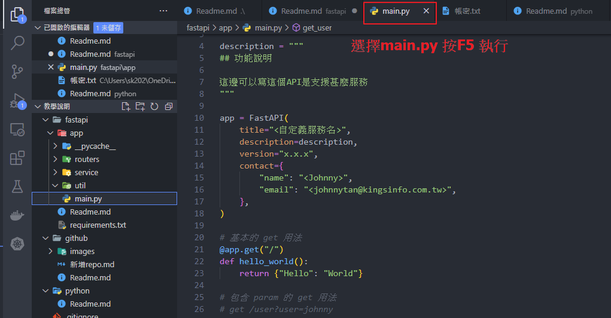
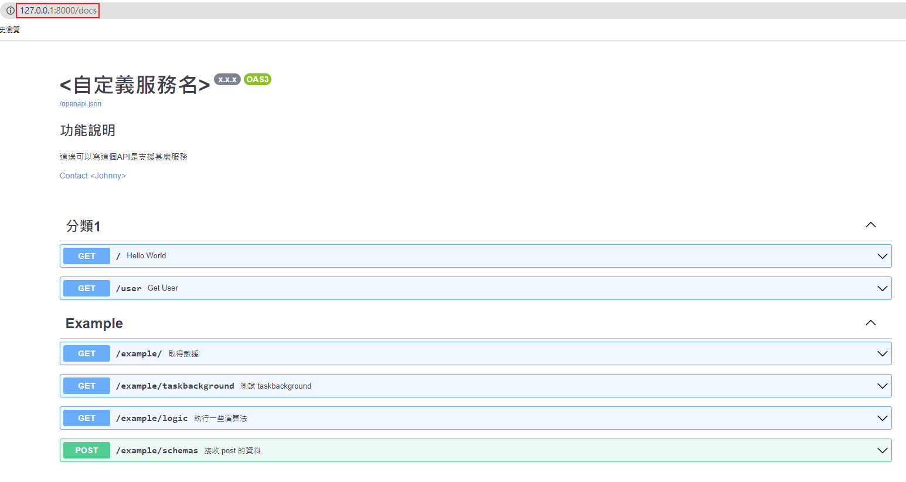
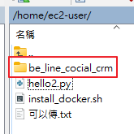
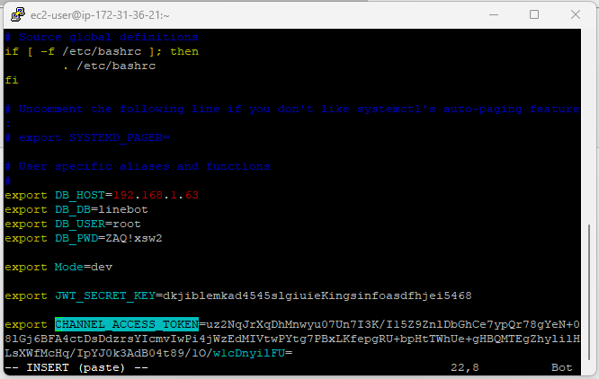

# fastapi 範例

這邊會說明 `fastapi` 這個套件的功能和使用方法
# test for auto ci
## 目錄

- [fastapi 範例](#fastapi-範例)
  - [目錄](#目錄)
  - [說明](#說明)
  - [安裝所需套件](#安裝所需套件)
  - [測試](#測試)
  - [主要 API 檔案](#主要-api-檔案)
    - [settings.py](#settingspy)
    - [util 資料夾](#util-資料夾)
    - [新增擴充功能](#新增擴充功能)
  - [API 規格文件](#api-規格文件)
  - [Docker 啟動 API](#docker-啟動-api)
    - [第一步 上傳程式碼](#第一步-上傳程式碼)
    - [第二步 確認環境變數](#第二步-確認環境變數)
    - [第三步 啟動 API](#第三步-啟動-api)
      - [修改程式、環境變數](#修改程式環境變數)
    - [第四步 除錯](#第四步-除錯)

## 說明

`fastapi` 是近年來受歡迎的框架之一，速度非常的快，也結合 `swagger UI` 直接無痛查看 API spec 文件

## 安裝所需套件

在和 `requirements.txt` 相同目錄下執行 `pip install -r requirements.txt` 安裝。

## 測試

當安裝完套件後，可以使用vscode的功能啟動，如下圖

## 主要 API 檔案

切入點為 `main.py`，如果有擴充功能例如: `example` 就需要額外新增

### settings.py

存放程式需要的參數，可以設定先讀取環境變數，例如: `DB_HOST = os.getenv('DB_HOST')` 就可以針對正式機、測試機的程式讀取不同的 DB 連線資訊

### util 資料夾

這裡存放比較常用但是很少會修改的檔案，例如 db 連線程式、資料檢查程式

### 新增擴充功能

例如專案需要增加ERP的會計演算法，可以像 `routers` 裡面的 `example`，在 routers 裡面建立一個 `erp_accounting`，

包含了 `urls.py`、`schemas.py`、`service`(資料夾)

- `urls.py` 用來處理 url 對應的部分
- `schemas.py` 用來定義輸入輸出的資料格式
- `service`(資料夾) 存放演算法邏輯

## API 規格文件

當我們把API寫好了，要給前端查閱，只要輸入 `/docs` 就有完整的 swagger UI 文件，

只要在程式碼當中寫好說明，就會直接反映在 swagger UI。

## Docker 啟動 API

### 第一步 上傳程式碼

把我們寫好的 API 上傳到 EC2 主機，連資料夾一起

### 第二步 確認環境變數

打開 `putty`，輸入 `vim ~/.bashrc`，在最下面新增我們所需要的環境變數

儲存後輸入 `bash` 重新讓系統讀取環境變數

> 讓 API 能讀取到環境變數的設定在 docker-compose.yml 裡面的 environment 這裡

### 第三步 啟動 API

打開 `putty`，切換到上傳的資料夾內 `cd be_line_cocial_crm`

輸入 `docker-compose up -d` 就會開始一系列安裝流程，最後啟動 API

> `-d` 參數是讓 docker 在背景執行，測試階段可以先不要 -d 比較好找問題

#### 修改程式、環境變數

修改過後要執行 `docker-compose up -d --build` 重新建立 `images`

> `--build` 就是重新建立 images

### 第四步 除錯

可以先使用 `docker-compose up` 執行過一遍，過程當中可能會發現程式套件沒有安裝的錯誤

再把套件寫到 `requirements.txt`，等程式能正常使用後，

再執行 `docker-compose up -d` 背景執行。
